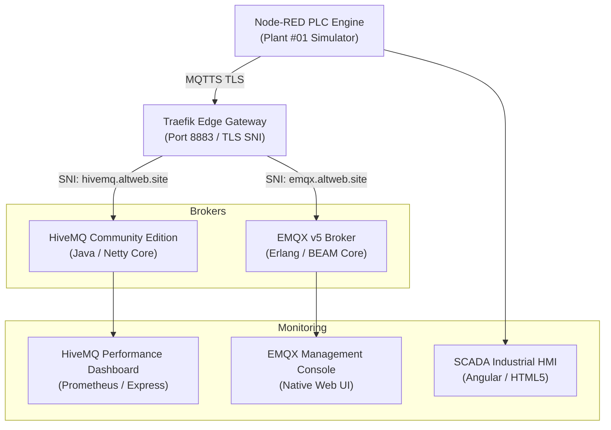

# Industrial IoT Architecture & Unified Namespace (UNS) Knowledge Dossier
**Project:** Water Treatment Plant (WTP) SCADA Simulator & Dual Broker Infrastructure  
**Author:** Operational Technology & Reliability Engineering  
**Version:** 1.0 (Production Architecture)  
**Enterprise Domain:** `altweb.site`  
**Infrastructure Target:** HiveMQ CE & EMQX v5 Enterprise Dual-Broker Mesh  

---

## Table of Contents
1. [Executive Summary & Problem Statement](#1-executive-summary--problem-statement)
2. [Unified Namespace (UNS) & ISA-95 Framework](#2-unified-namespace-uns--isa-95-framework)
3. [Dual-Broker Topology & Multi-Cloud Architecture](#3-dual-broker-topology--multi-cloud-architecture)
4. [Transport Layer Security (TLS/MQTTS) & Traefik SNI Routing](#4-transport-layer-security-tlsla-mqtts-and-traefik-sni-routing)
5. [Deterministic SCADA Simulation Engine & Process Physics](#5-deterministic-scada-simulation-engine--process-physics)
6. [Human-Machine Interface (HMI) & Real-Time Performance Dashboards](#6-human-machine-interface-hmi--real-time-performance-dashboards)
7. [Telemetry Payload Standard & Data Contracts](#7-telemetry-payload-standard--data-contracts)
8. [Comparative Broker Analysis: HiveMQ CE vs. EMQX v5](#8-comparative-broker-analysis-hivemq-ce-vs-emqx-v5)
9. [Operational Runbook & GitOps Deployment](#9-operational-runbook--gitops-deployment)
10. [Strategic Roadmap & Next Steps](#10-strategic-roadmap--next-steps)

---

## 1. Executive Summary & Problem Statement

Modern Industrial IoT (IIoT) systems face severe architectural fragmentation when scaling from edge Programmable Logic Controllers (PLCs) to supervisory SCADA systems, manufacturing execution systems (MES), and enterprise cloud analytics. Traditional automation systems rely on point-to-point connections, creating fragile "spaghetti architectures" that resist modification, require custom polling drivers, and lack a single source of truth.

This project delivers a production-grade **Unified Namespace (UNS)** architecture based on **ISA-95** standards, validated through an operational **Water Treatment Plant (WTP)** simulation engine and a **Dual-Broker MQTT mesh** (HiveMQ CE + EMQX) routed over encrypted TLS (port `8883`).

### Key Project Achievements
* **Zero-Trust Encrypted Mesh:** Secured MQTTS port `8883` for both HiveMQ and EMQX using Let's Encrypt automated TLS certificates with Traefik Server Name Indication (SNI) routing.
* **ISA-95 Hierarchical Namespace:** 11 distinct telemetry tags published with standardized JSON payloads, quality flags, and retention policies.
* **Deterministic Simulation Engine:** Full PLC emulation running in Node-RED with dynamic process setpoints, pump interlocks, tank mass balancing, and safety alarm annunciators.
* **Full-Width Industrial HMI:** Single-page real-time SCADA dashboard deployed at `https://nodered.altweb.site/ui/`.
* **Side-by-Side Broker Performance Analytics:** Custom HiveMQ performance dashboard (`https://hivemq-dash.altweb.site`) matching native EMQX monitoring (`https://emqx-dash.altweb.site`).

```
                              [ ISA-95 Unified Namespace (UNS) ]
                                              │
                      ┌───────────────────────┴───────────────────────┐
                      ▼                                               ▼
         [ HiveMQ CE Broker ]                                 [ EMQX v5 Broker ]
     hivemq.altweb.site:8883 (TLS)                       emqx.altweb.site:8883 (TLS)
     hivemq-dash.altweb.site                              emqx-dash.altweb.site
                      ▲                                               ▲
                      │               MQTTS (TLS 8883)                │
                      └───────────────────────┬───────────────────────┘
                                              │
                                   [ Node-RED PLC Engine ]
                                  nodered.altweb.site/ui/
                                 Water Treatment Simulator
```

---

## 2. Unified Namespace (UNS) & ISA-95 Framework

### 2.1 The UNS Architectural Pattern
The Unified Namespace (UNS) is a shared, real-time repository of all contextualized data across the manufacturing enterprise. In this model:
* **All nodes act as Publisher/Subscriber:** Sensors, PLCs, edge computers, SCADA HMIs, time-series historians, and AI/ML algorithms communicate through an event-driven publish/subscribe broker.
* **Topic structure defines physical and operational context:** The MQTT topic path follows the ISA-95 physical hierarchy:
  `[Enterprise] / [Site] / [Area] / [WorkCenter_or_Process] / [Asset_or_Instrument] / [Data_Type]`

### 2.2 Topic Matrix & Instrument Registry

| Tag Name | ISA-95 UNS Topic | Process Description | Engineering Unit | Normal Operating Range | Alarm Limits |
| :--- | :--- | :--- | :--- | :--- | :--- |
| **`FIT101`** | `altweb/plant01/water_treatment/raw_water/FIT101/telemetry` | Raw Water Inflow Rate | $\text{m}^3/\text{h}$ | $0 - 200$ | - |
| **`LIT101`** | `altweb/plant01/water_treatment/raw_water/LIT101/telemetry` | Raw Water Basin Level | $\%$ | $20 - 85$ | $\text{High} > 88\%$ |
| **`P101`** | `altweb/plant01/water_treatment/raw_water/P101/state` | Raw Water Intake Pump State | `RUNNING` / `STOPPED` | Discrete | Fault Interlock |
| **`LIT201`** | `altweb/plant01/water_treatment/dosing/LIT201/telemetry` | Coagulant Chemical Storage | $\%$ | $20 - 100$ | $\text{Low} < 20\%$ |
| **`FIT201`** | `altweb/plant01/water_treatment/dosing/FIT201/telemetry` | Coagulant Dosing Rate | $\text{L}/\text{h}$ | $0 - 25$ | Proportional |
| **`M301`** | `altweb/plant01/water_treatment/mixing/M301/speed` | Flash Mixer Agitator Speed | $\text{RPM}$ | $0 - 1500$ | Low Speed Alarm |
| **`LIT301`** | `altweb/plant01/water_treatment/clarifier/LIT301/telemetry` | Clarifier Settling Basin Level | $\%$ | $30 - 80$ | Overflow Warning |
| **`FIT401`** | `altweb/plant01/water_treatment/treated_water/FIT401/telemetry` | Treated Water Outflow Rate | $\text{m}^3/\text{h}$ | $0 - 200$ | - |
| **`P401`** | `altweb/plant01/water_treatment/treated_water/P401/state` | Distribution Discharge Pump | `RUNNING` / `STOPPED` | Discrete | Fault Interlock |
| **`LIT101_HIGH`**| `altweb/plant01/water_treatment/alarms/LIT101_HIGH` | Raw Basin High Alarm State | `NORMAL` / `ALARM` | Discrete | Active at $>88\%$ |
| **`LIT201_LOW`** | `altweb/plant01/water_treatment/alarms/LIT201_LOW` | Chemical Low Alarm State | `NORMAL` / `ALARM` | Discrete | Active at $<20\%$ |

---

## 3. Dual-Broker Topology & Multi-Cloud Architecture

To evaluate fault-tolerance, vendor flexibility, and comparative latency, the platform operates dual industrial brokers concurrently:



### 3.1 Broker Characteristics

#### 1. HiveMQ Community Edition (CE)
* **Underlying Runtime:** Java 17 / Netty asynchronous I/O framework.
* **Extensibility:** Open-source extension SPI (`hivemq-file-security-extension` for RBAC and `hivemq-prometheus-extension` for OpenMetrics).
* **Target Environment:** Enterprise edge-to-cloud IoT with strict Java ecosystem integrations.

#### 2. EMQX v5 (Open Source)
* **Underlying Runtime:** Erlang/OTP / BEAM virtual machine.
* **Concurrency Model:** Actor-based concurrency capable of millions of simultaneous lightweight connections per node.
* **Built-in Capabilities:** Native Rule Engine, SQL-based stream processing, and integrated HTTP management UI.

---

## 4. Transport Layer Security (TLS/MQTTS) and Traefik SNI Routing

Securing industrial telemetry requires encryption in transit to prevent packet sniffing and man-in-the-middle (MITM) attacks on critical infrastructure control loops.

### 4.1 Traefik TCP SNI Configuration
Traefik operates as the edge reverse proxy, terminating TLS at port `8883` using automatic Let's Encrypt certificates while routing incoming TCP connections to the appropriate broker based on TLS Server Name Indication (SNI):

```yaml
# Traefik TCP Router in docker-compose.yml
labels:
  - "traefik.enable=true"
  - "traefik.tcp.routers.hivemq-mqtt.rule=HostSNI(`hivemq.altweb.site`) || HostSNI(`154.26.158.128.nip.io`)"
  - "traefik.tcp.routers.hivemq-mqtt.entrypoints=mqtts"
  - "traefik.tcp.routers.hivemq-mqtt.tls=true"
  - "traefik.tcp.routers.hivemq-mqtt.tls.certresolver=letsencrypt"
  - "traefik.tcp.services.hivemq-mqtt.loadbalancer.server.port=1883"
```

### 4.2 Role-Based Access Control (RBAC)
Authentication is enforced on HiveMQ using salted SHA-256 password hashing inside `credentials.xml`:
```xml
<credentials>
    <users>
        <user>
            <name>admin</name>
            <password>3102fc9fc4c77651a029318b76ceafecda1922c2f6d289945037d7a31b46ea68</password>
            <roles>
                <role>admin-role</role>
            </roles>
        </user>
    </users>
</credentials>
```

---

## 5. Deterministic SCADA Simulation Engine & Process Physics

The simulation runs deterministic physical equations at a 1-second scan rate ($1\text{ Hz}$) inside Node-RED.

### 5.1 Mass Balance Differential Equations

$$\frac{d(\text{LIT101})}{dt} = \frac{\text{FIT101} - \text{TransferRate}_{\text{P101}}}{C_1}$$

$$\frac{d(\text{LIT301})}{dt} = \frac{\text{TransferRate}_{\text{P101}} - \text{FIT401}_{\text{P401}}}{C_2}$$

Where:
* $\text{FIT101}$: Raw water inflow modulated by operator setpoint with Gaussian noise ($\pm 1.8\text{ m}^3/\text{h}$).
* $\text{TransferRate}_{\text{P101}}$: Intake transfer rate ($95\text{ m}^3/\text{h}$ when pump `P101` is `RUNNING`, $0$ when `STOPPED`).
* $\text{FIT201}$: Dosing rate calculated proportionally: $\text{FIT201} = \left(\frac{\text{TransferRate}}{100}\right) \times 12.5\text{ L/h}$.
* $\text{FIT401}$: Discharge outflow ($93\text{ m}^3/\text{h}$ when pump `P401` is `RUNNING`, $0$ when `STOPPED`).
* $C_1, C_2$: Basin volumetric capacitance factors ($50.0$).

### 5.2 Deterministic Safety Interlocks
1. **Raw Tank High Level Trip:** If $\text{LIT101} > 88.0\%$, trigger `LIT101_HIGH` alarm topic.
2. **Chemical Depletion Alarm:** If $\text{LIT201} < 20.0\%$, trigger `LIT201_LOW` alarm topic.
3. **Emergency Mute:** When simulator is `STOPPED`, MQTT transmissions cease immediately, freezing state values and preventing false zero-data alarms.

---

## 6. Human-Machine Interface (HMI) & Real-Time Performance Dashboards

```
┌──────────────────────────────────────────────────────────────────────────────────────────┐
│  ALTWEB WATER TREATMENT FACILITY — SCADA HMI                   [ACTIVE: UNS Broadcast]   │
├───────────────────┬───────────────────┬──────────────────────┬───────────────────────────┤
│ Raw Inflow FIT101 │ Outflow FIT401    │ Chemical Dosing      │ Flash Mixer M301          │
│ 100.4 m³/h        │ 93.1 m³/h         │ 12.5 L/h             │ 902 RPM                   │
├───────────────────┴───────────────────┴──────────────────────┴───────────────────────────┤
│                                                                                          │
│   [ AREA 01 ]           [ DOSING ]            [ MIXING ]            [ CLARIFIER ]        │
│   ┌────────┐            ┌────────┐              ( 🌀 )              ┌────────┐           │
│   │~~~~~~~~│ 65.4%      │~~~~~~~~│ 84.8%       902 RPM              │~~~~~~~~│ 55.2%     │
│   └────────┘            └────────┘                                  └────────┘           │
│   Intake P101: RUN      Rate: 12.5 L/h        Setpoint: 900         Outflow P401: RUN    │
│                                                                                          │
├───────────────────────────────┬──────────────────────────────┬───────────────────────────┤
│ Process Controls & Sliders    │ Mass Balance Summary         │ Safety & Alarms           │
│ • Inflow: [────●────] 100 m³/h│ • Net Delta: +7.3 m³/h       │ • LIT101 Level: NORMAL    │
│ • Mixer:  [──────●──] 900 RPM │ • Active UNS Topics: 11      │ • LIT201 Level: NORMAL    │
└───────────────────────────────┴──────────────────────────────┴───────────────────────────┘
```

### 6.1 Dashboard Endpoints
* **Plant SCADA HMI:** `https://nodered.altweb.site/ui/` (Full-width edge-to-edge layout, responsive CSS, animated fluid SVG tanks, operator toggles).
* **HiveMQ Performance Dashboard:** `https://hivemq-dash.altweb.site` (EMQX-matching UI with live 1s rolling sparklines, active connections, retained topics, and 6 time-series trend graphs).
* **EMQX Performance Dashboard:** `https://emqx-dash.altweb.site` (Native Erlang cluster metrics).

---

## 7. Telemetry Payload Standard & Data Contracts

All messages published to the Unified Namespace adhere to a strict, self-describing JSON payload standard ensuring plug-and-play interoperability:

```json
{
  "timestamp": 1786840320000,
  "value": 100.42,
  "unit": "m³/h",
  "quality": "GOOD",
  "description": "Raw Water Inflow Rate",
  "plant_mode": "RUNNING"
}
```

### 7.1 Field Definitions
* `timestamp` (Unix Epoch Milliseconds): Precise sensor measurement time at the PLC scan edge.
* `value` (Float / Integer / String): The measured process variable or discrete state.
* `unit` (String): Standardized SI or engineering unit (`m³/h`, `%`, `RPM`, `L/h`).
* `quality` (Enum: `GOOD` | `UNCERTAIN` | `BAD`): High-integrity data quality flag following OPC-UA / Sparkplug B conventions.
* `description` (String): Human-readable instrument designation for autonomous discoverability.
* `plant_mode` (Enum: `RUNNING` | `STOPPED` | `MAINTENANCE`): Global operational mode.

---

## 8. Comparative Broker Analysis: HiveMQ CE vs. EMQX v5

| Architectural Dimension | HiveMQ Community Edition (CE) | EMQX v5 (Open Source) |
| :--- | :--- | :--- |
| **Engine Core** | Java 17 (JVM) / Netty Non-blocking IO | Erlang/OTP / BEAM Actor Model |
| **Connection Capacity** | High throughput, scales with JVM memory heap | Ultra-high concurrency (millions of concurrent lightweight actors) |
| **Native Management UI** | No native UI in CE (Solved by our custom dashboard) | Full-featured native Vue/TypeScript Web Dashboard |
| **Metrics Pipeline** | Prometheus Extension (OpenMetrics on port 9399) | Built-in Prometheus `/api/v5/prometheus/stats` |
| **Security & Auth** | XML-based File RBAC, X.509 mTLS | Native Mnesia DB, MySQL, PostgreSQL, JWT, LDAP, HTTP Auth |
| **Rule Engine / ETL** | Custom Java Extensions | Built-in SQL stream processing rules engine |
| **Deployment Footprint** | ~350 MB RAM base | ~120 MB RAM base |
| **Primary Strength** | Enterprise Java integration, predictable enterprise compliance | High-density connections, native clustering, low resource overhead |

---

## 9. Operational Runbook & GitOps Deployment

The entire stack is configured via **GitOps** and orchestrated through Dokploy.

### 9.1 Repository Structure
```
├── docker-compose.yml              # Multi-container orchestration (HiveMQ, Dashboard, Volumes)
├── dashboard/                      # HiveMQ Performance Dashboard web application
│   ├── Dockerfile                  # Node.js 20 Alpine container definition
│   ├── package.json                # Dependencies (Express, MQTT, Axios)
│   ├── server.js                   # Prometheus scraper & MQTT live telemetry monitor
│   └── public/                     # Frontend assets (index.html, style.css, app.js)
├── extensions/                     # HiveMQ Extensions directory
│   ├── hivemq-file-security-ext/   # Authentication & RBAC credentials
│   └── hivemq-prometheus-ext/      # OpenMetrics Prometheus exporter on :9399
└── wtp_uns_analytics.ipynb         # Python Jupyter Notebook for UNS data analytics
```

### 9.2 Zero-Downtime Deployment Workflow
1. Commit code and push to GitHub repository:
   ```bash
   git add .
   git commit -m "Update feature"
   git push origin master
   ```
2. Trigger automated Dokploy Compose rebuild via Webhook / MCP:
   ```bash
   Dokploy executes: docker compose up -d --build
   ```
3. Traefik automatically provisions and renews SSL certificates without interrupting active MQTT TCP sessions.

---

## 10. Strategic Roadmap & Next Steps

1. **Sparkplug B Integration:** Evaluate encoding UNS payloads in Google Protocol Buffers with Sparkplug B state management (`NBIRTH`, `DBIRTH`, `DDEATH`).
2. **Machine Learning Anomaly Detection:** Ingest telemetry from `wtp_uns_analytics.ipynb` into real-time autoencoders to detect flow leaks or pump cavitation.
3. **ERP / MES Connector:** Integrate with SAP / Odoo manufacturing work orders via MQTT-to-REST webhooks.
4. **Time-Series Historian:** Connect TimescaleDB or InfluxDB to archive UNS data for long-term predictive maintenance.

---
*Document compiled for Google NotebookLM knowledge base ingestion. © 2026 AltWeb Systems.*
